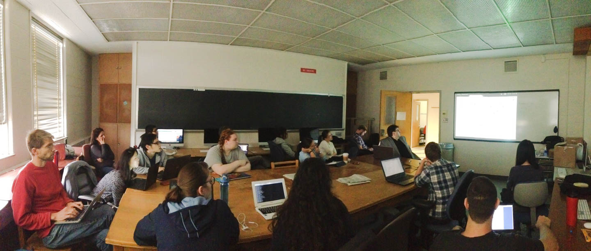

Title: Home
Template: page

Check out <a href="https://cl.indiana.edu/clingding.html" target="_blank">CLingDing</a> and the <a href="https://docs.google.com/document/d/1j9N4fAyOhQhuvd5D6Mqtlke20OCPBjlAPtmj2UbEUvs/edit?usp=sharing">Dependency Parsing Reading Group</a> — The IU Computational Linguistics Discussion/Reading Groups 
Corpora resources can be found at: <a href="https://cl.indiana.edu/corpora.html">Corpora locations</a> 
Contact: <a href="mailto:ftyers@indiana.edu">Francis Tyers</a>

